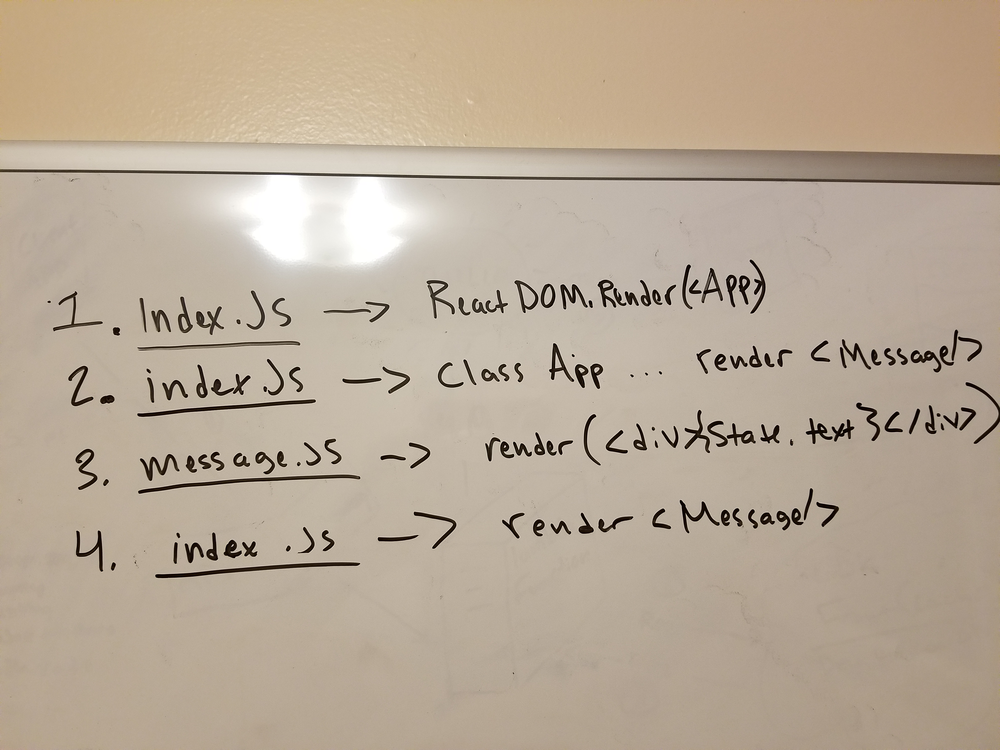
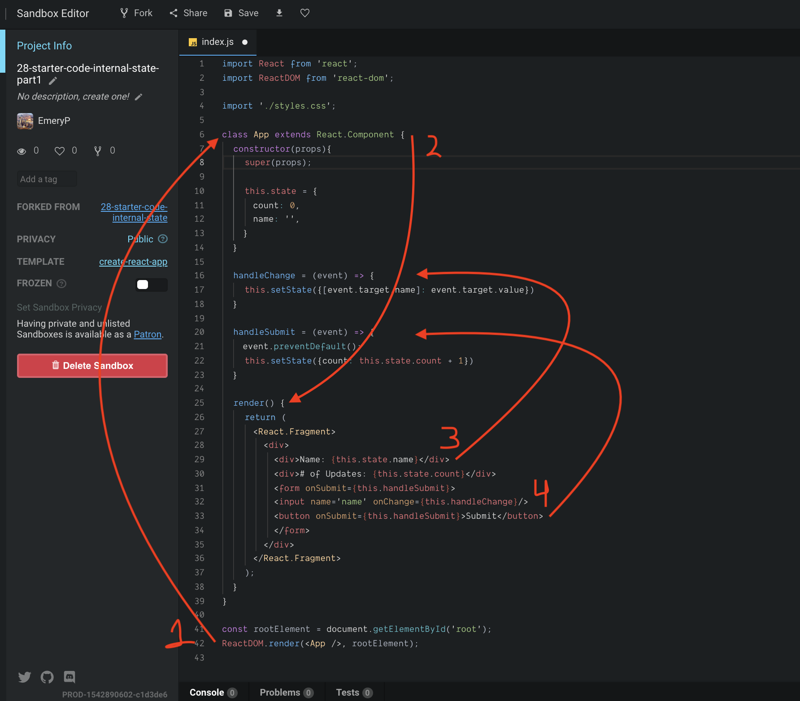
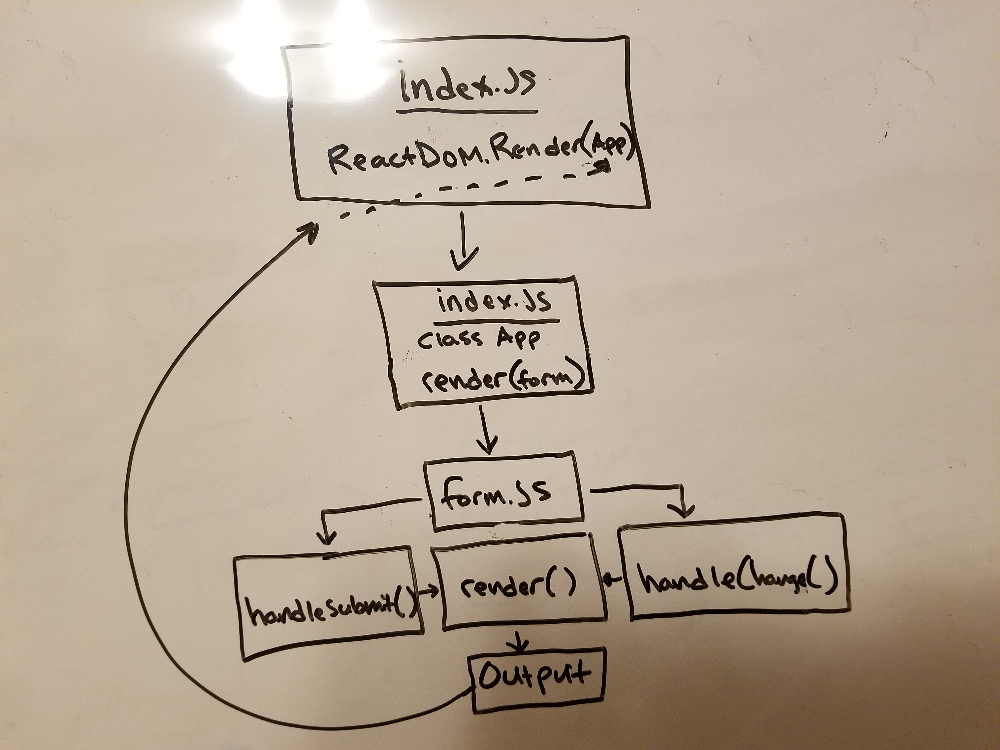

## Props and State Practice

### Links to Sandboxes
* [Props Practice Part 1 Sandbox](https://codesandbox.io/s/olzy674nwz)
* [Props Practice Part 2 Sandbox](https://codesandbox.io/s/541rv8zn2p)
* [Internal State Practice Part 1 Sandbox](https://codesandbox.io/s/00k120x38l)
* [Internal State Practice Part 2 Sandbox](https://codesandbox.io/s/1v3ow0q53j)
* [External State Practice Part 1 Sandbox](https://codesandbox.io/s/kk67r896o7)

#### UML
Props-practice-challenge-1

Props-practice-challenge-2

Internal-state-practice-challenge-1

Internal-state-practice-challenge-2

<!-- External-state-practice-challenge-1
 -->